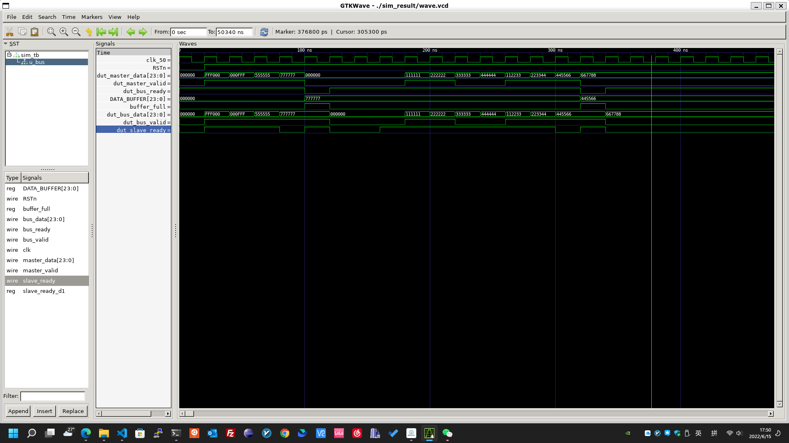

# datenlord_interview
An SPI TX scenario is created here.

It consists of three parts: `top`, `bus master`, `bus slave (spi_tx)`. The three parts have a `valid/ready` handshake.

`bus master` read datas from `top` and sends it out through `slave (spi_tx)` module.

The main frequency of the whole system is 50MHz, and The SPI works in 2MHz, 00 working mode and 24bit transmission.

